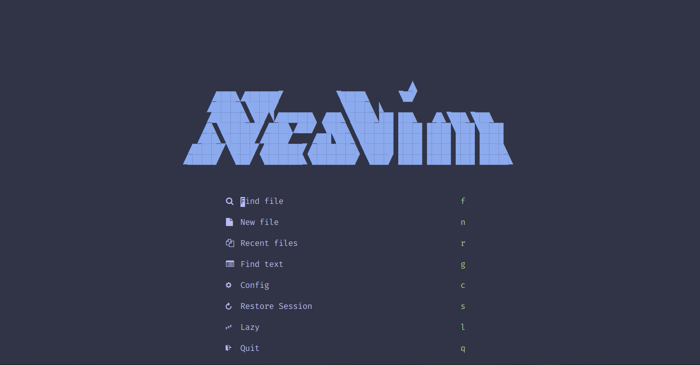
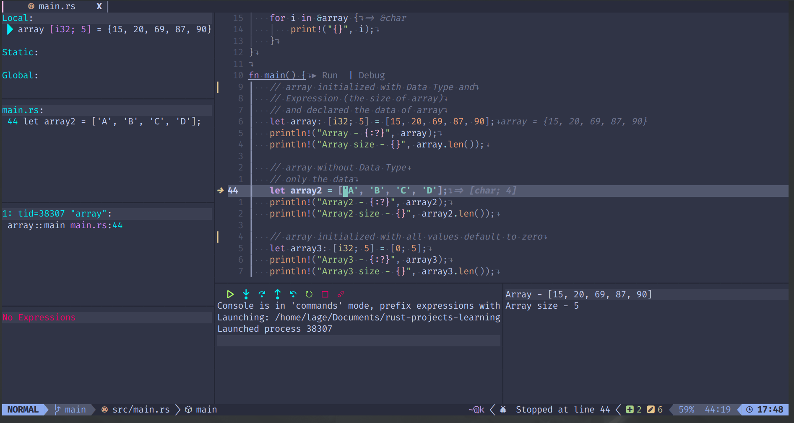

# nvim-config

#### This is my configuration of nvim :brazil:

***Neovim** startup* :star:

***Rust*** debug config :spades:

###### *TODO*

- [x] Add and change key binds for Gitsigns 
- [x] Add keymap to barbar.nvim 
- [x] Add keymaps to crates  
- [x] Change in the configuration files, make them more readable
- [x] Gitsigns prompt error on the git project is open.
- [x] Error call back of script or plugin.
- [x] Error on transparent background, have notification of error.
- [x] Configuration on notify plugin
- [x] Colorsheme modify configuration
- [x] Toggleterm error on call plugin
- [ ] Keybind **w** to save, has ambiguous bind
- [ ] Project.nvim overriding 
- [ ] Nvim-dap-ui overriding
- [ ] Rust-tools.nvim overriding 
- [ ] Nvim.treesitter-textobjects overriding
- [x] Flit.nvim overriding
- [x] Leap.nvim overriding
- [x] Crates.nvim unknown keys 

##### *More options could be added later*
